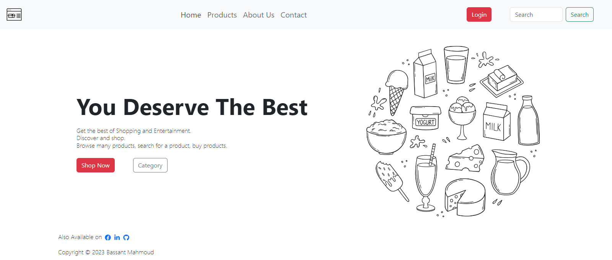
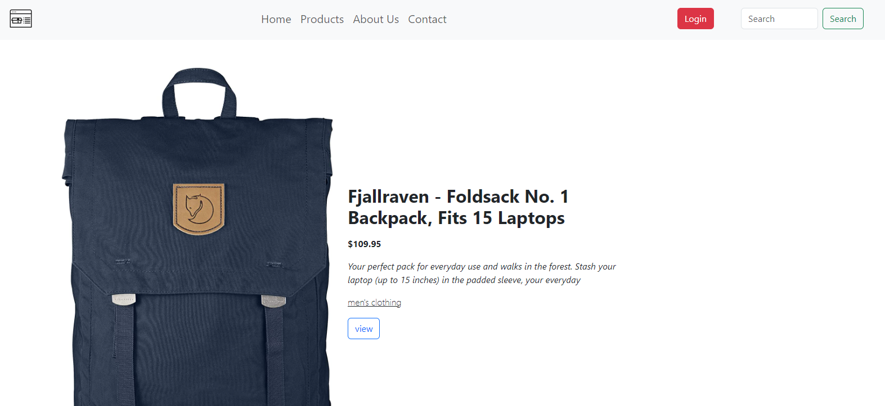
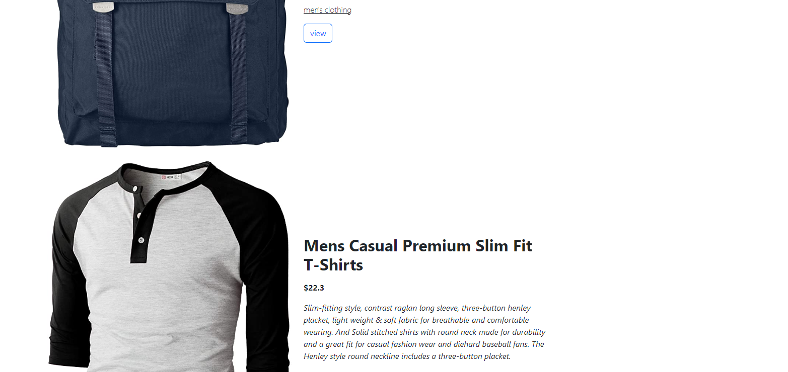
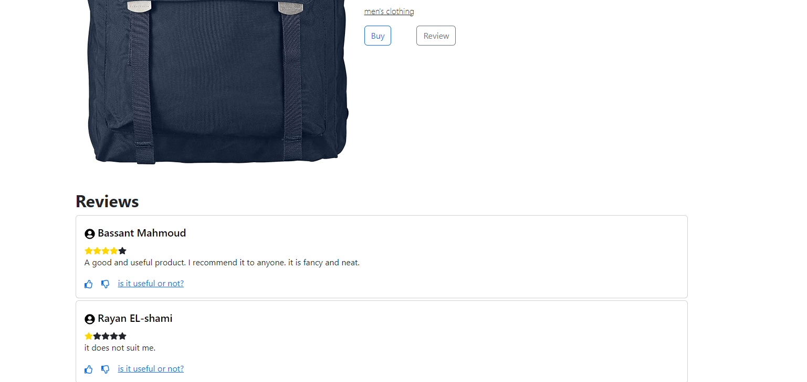
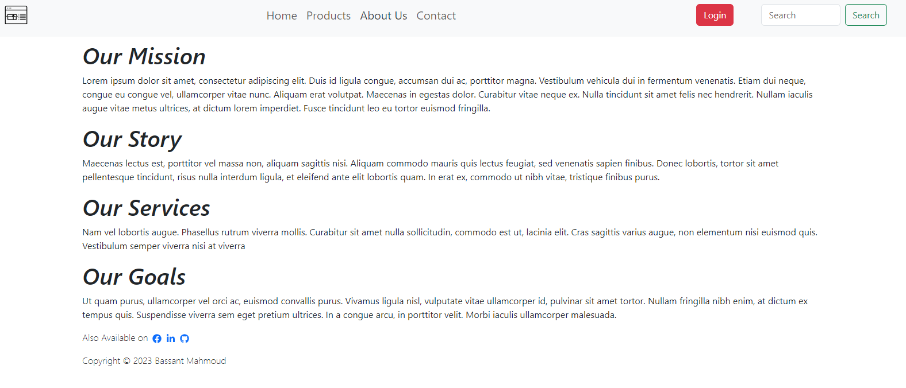
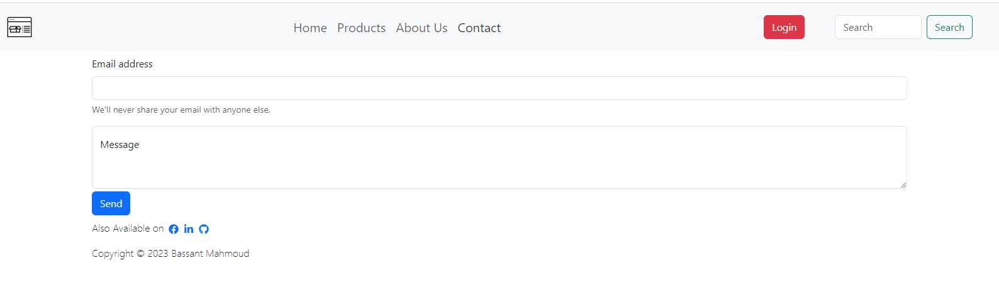

# simple-ecommerce-website
## Installations
run these in project terminal to install react icons, bootsrap, and react router: \
npm install react-icons --save \
npm install bootstrap \
npm i -D react-router-dom

## Products API
https://fakestoreapi.com/ \
https://github.com/keikaavousi/fake-store-api

## Website Description
This website alows the users to view different products, rate them, and search for products.

### Home page

### Products page

**scroll more**

### Part of a Product page

### About us page

### Contact page

